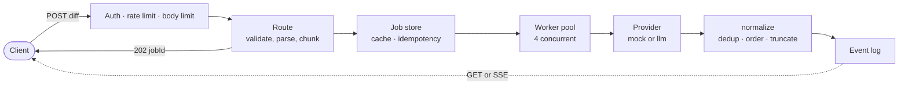

# AI Diff Review Service

An HTTP service that reviews code changes. You send it a unified diff; it
analyses the added lines asynchronously and returns structured findings, either
by polling or over a live event stream.

> **Reviewing this as a take-home submission?** [SUBMISSION.md](SUBMISSION.md)
> has the architecture, the judgement calls, and how each cross-cutting
> behaviour was verified.

## What it does

Send it a diff:

```diff
 function pay(id) {
+  const sql = "SELECT * FROM orders WHERE id = " + id;
+  const token = "sk_live_9f3a2b7c1d4e8f0a";
+  console.log(sql); // TODO remove
```

Get back findings:

| line | severity | category | title |
|------|----------|----------|-------|
| 11 | high | security | SQL string concatenation |
| 12 | critical | security | hardcoded credential |
| 13 | low | style | console.log left in |
| 13 | low | style | unresolved marker |

Rules apply to **added lines only** — the lines a review would actually be about.
`line` is the line number in the new file.

Two review engines sit behind one interface:

- **`mock`** (default) — nine deterministic rules, no model involved. Same input
  always gives the same output, which is what makes the pipeline testable
  independently of any AI.
- **`llm`** — a real model (Groq's OpenAI-compatible API) doing the reviewing.
  Credentials live only on the server. If the model is unreachable the job fails
  cleanly; the service never crashes.

### The mock rule set

| ruleId | severity | category | fires on |
|---|---|---|---|
| `MOCK-001` | critical | security | `eval(` |
| `MOCK-002` | critical | security | a hardcoded key, secret or token |
| `MOCK-003` | high | security | a SQL keyword in a string glued together with `+` |
| `MOCK-004` | high | correctness | an empty `catch` block, even across lines |
| `MOCK-005` | medium | correctness | `== null` or `!= null` (not `===`) |
| `MOCK-006` | medium | performance | `JSON.parse(JSON.stringify(` |
| `MOCK-007` | low | style | `console.log(` |
| `MOCK-008` | low | style | `TODO` or `FIXME` |
| `MOCK-INJ` | critical | security | prompt-injection phrasing in the diff |

`MOCK-INJ` is reported as a finding and treated as inert text. Instructions
embedded in a diff never influence how the service behaves.

## How it works



The response to a submission is immediate — a job id and `queued`. The work
happens on a pool of four workers; a fifth submission waits its turn rather than
being rejected. Results are collected either by polling the job or by opening an
SSE stream, and a stream opened *after* the job finished replays every event it
emitted.

Diffs over 64 KiB are split into chunks, never mid-file. Because every rule is
scoped to a single file, a chunked scan and an unchunked scan produce byte-identical
findings — which is asserted directly in `tests/test_chunking.py`.

## Quick start

```bash
pip install -e ".[dev]"

# a bearer token is required; the service fails closed without one
export API_BEARER_TOKEN="$(python -c 'import secrets; print(secrets.token_urlsafe(32))')"

uvicorn app.main:app --host 0.0.0.0 --port 8000
```

With Docker:

```bash
docker build -t ai-diff-review .
docker run -p 8000:8000 -e API_BEARER_TOKEN=your-token ai-diff-review
```

Submit a review:

```bash
TOKEN=your-token
DIFF=$(git diff HEAD~1 | python -c 'import json,sys; print(json.dumps(sys.stdin.read()))')

JOB=$(curl -sS -X POST localhost:8000/v1/reviews \
  -H "Authorization: Bearer $TOKEN" -H 'Content-Type: application/json' \
  -d "{\"diff\": $DIFF}" | python -c 'import json,sys; print(json.load(sys.stdin)["jobId"])')

curl -sS  localhost:8000/v1/reviews/$JOB        -H "Authorization: Bearer $TOKEN"
curl -sSN localhost:8000/v1/reviews/$JOB/stream -H "Authorization: Bearer $TOKEN"
```

## API

| Route | Auth | Returns |
|---|---|---|
| `GET /health` | public | `{status, version, uptimeSeconds}` |
| `GET /spec` | public | declared providers and limits |
| `POST /v1/reviews` | bearer | `202 {jobId, status: "queued"}` |
| `GET /v1/reviews/{jobId}` | bearer | status, findings once `done`, usage |
| `GET /v1/reviews/{jobId}/stream` | bearer | SSE: `status`, `finding`, `done` |

**Request body**

```json
{
  "diff": "<unified diff>",
  "options": { "provider": "mock", "maxFindings": 100 }
}
```

`options` is optional; unknown body fields are ignored.

**Finding**

```json
{
  "id": "MOCK-003:src/db.ts:41",
  "ruleId": "MOCK-003",
  "path": "src/db.ts",
  "line": 41,
  "severity": "high",
  "category": "security",
  "title": "SQL string concatenation",
  "evidence": "  const sql = \"SELECT * FROM t WHERE id = \" + id;"
}
```

Findings are ordered by `path`, then `line`, then `ruleId`, and de-duplicated by
`id` — in results *and* in the event stream.

**Idempotency** — send `Idempotency-Key: <key>`. The same key with a
byte-identical body returns the same `jobId`; the same key with a different body
is a `409`.

**Caching** — an identical `{diff, options}` submitted again is not re-analysed.
It gets a fresh `jobId` reporting `"cacheHit": true` with identical findings.

**Errors** always use one envelope:

```json
{ "error": { "code": "invalid_diff", "message": "..." } }
```

Codes: `unauthorized`, `payload_too_large`, `invalid_json`, `invalid_diff`,
`idempotency_conflict`, `not_found`, `rate_limited`, `internal`.

**Rate limiting** applies to `POST /v1/reviews` only — never to GETs or the
stream. A sustained 30/min always succeeds; a burst beyond that gets `429` with
`Retry-After`.

## Configuration

| Variable | Required | Default | Purpose |
|---|---|---|---|
| `API_BEARER_TOKEN` | **yes** | — | Token for all `/v1/*` routes. Unset ⇒ every `/v1` request is `401`. |
| `PORT` | no | `8000` | Listen port (most hosts inject this). |
| `GROQ_API_KEY` | for `llm` | — | Groq key. Without it, `llm` jobs fail cleanly; `mock` is unaffected. |
| `LLM_BASE_URL` | no | `https://api.groq.com/openai/v1` | Any OpenAI-compatible endpoint. |
| `LLM_MODEL` | no | `openai/gpt-oss-120b` | Model id. |
| `LLM_TIMEOUT_SECONDS` | no | `20` | Per-request ceiling, kept under the 30 s job budget. |
| `LLM_MAX_CHUNKS` | no | `8` | Cap on chunks sent to the model per job. |

Copy `.env.example` to `.env` and fill it in. **`.env` is gitignored; never put a
real key in `.env.example`.**

The limits reported by `GET /spec` are deliberately not configurable — they are
constants in `app/config.py`, read by the middleware, the chunker, the worker
pool *and* the spec route, so the declaration cannot drift from actual behaviour.

## Tests

```bash
pytest                                                  # 141 in-process tests
python scripts/probe.py http://localhost:8000 "$API_BEARER_TOKEN"
```

`scripts/probe.py` runs the whole contract against a **running** instance over a
real socket — 59 checks, non-zero exit on any failure. It exists because some
things only break in deployment: a proxy buffering SSE, a platform capping
request bodies, a cold start blowing the latency budget. It shares its diff
fixtures with the pytest suite so the two cannot drift apart.

```bash
powershell -ExecutionPolicy Bypass -File scripts\serve.ps1   # service + tunnel, detached
```

## Layout

```text
app/
  config.py       every declared limit, defined once
  main.py         app factory, middleware order, error envelope
  models.py       Finding / Job / Usage, and the single ordering chokepoint
  state.py        process-wide state, built per app
  errors.py       the error envelope and its code vocabulary
  deps/           auth · rate limit · body limit  (raw ASGI middleware)
  diff/           parser.py (state machine) · chunker.py (file boundaries)
  providers/      base.py (interface) · mock.py (rules) · llm.py (Groq)
  jobs/           store.py · cache.py (content + idempotency) · queue.py (pool)
  events/         bus.py (append-only log) · sse.py (wire format)
tests/            141 tests: unit, contract, property
scripts/
  probe.py        contract probe against a live URL
  serve.ps1       start service + Cloudflare tunnel, detached
```
