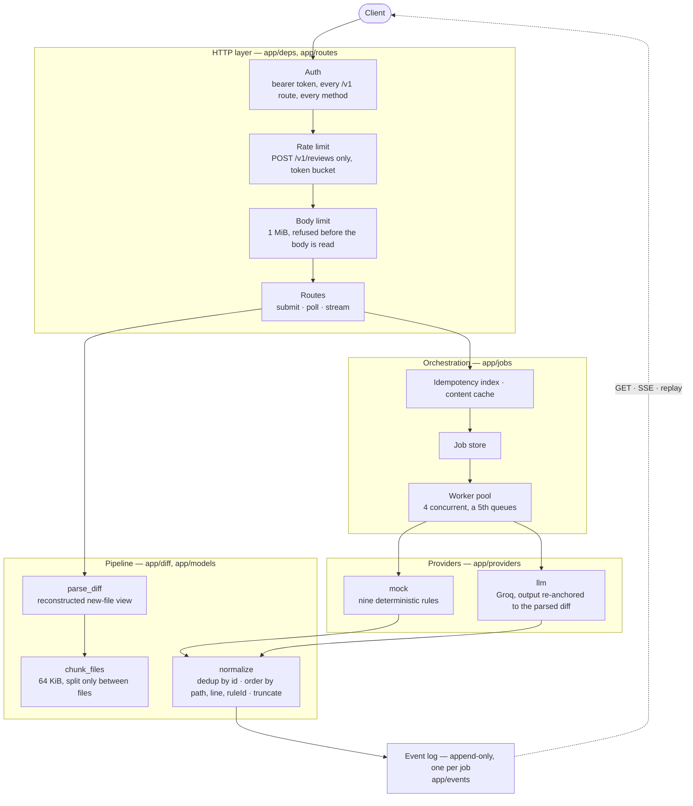
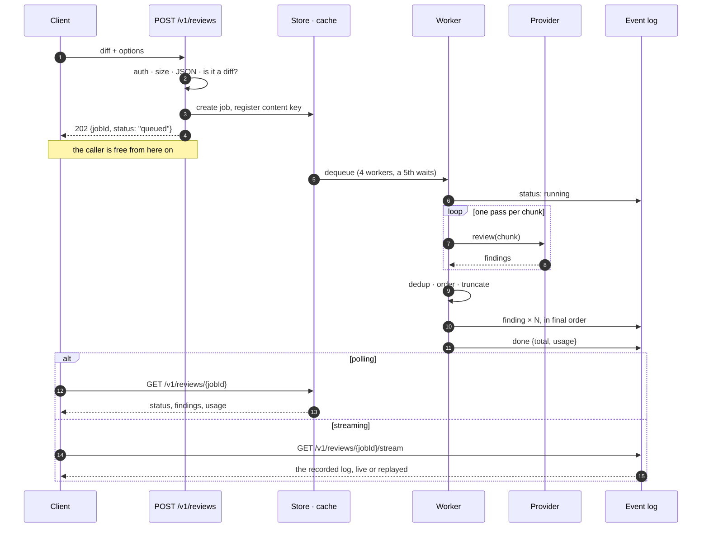
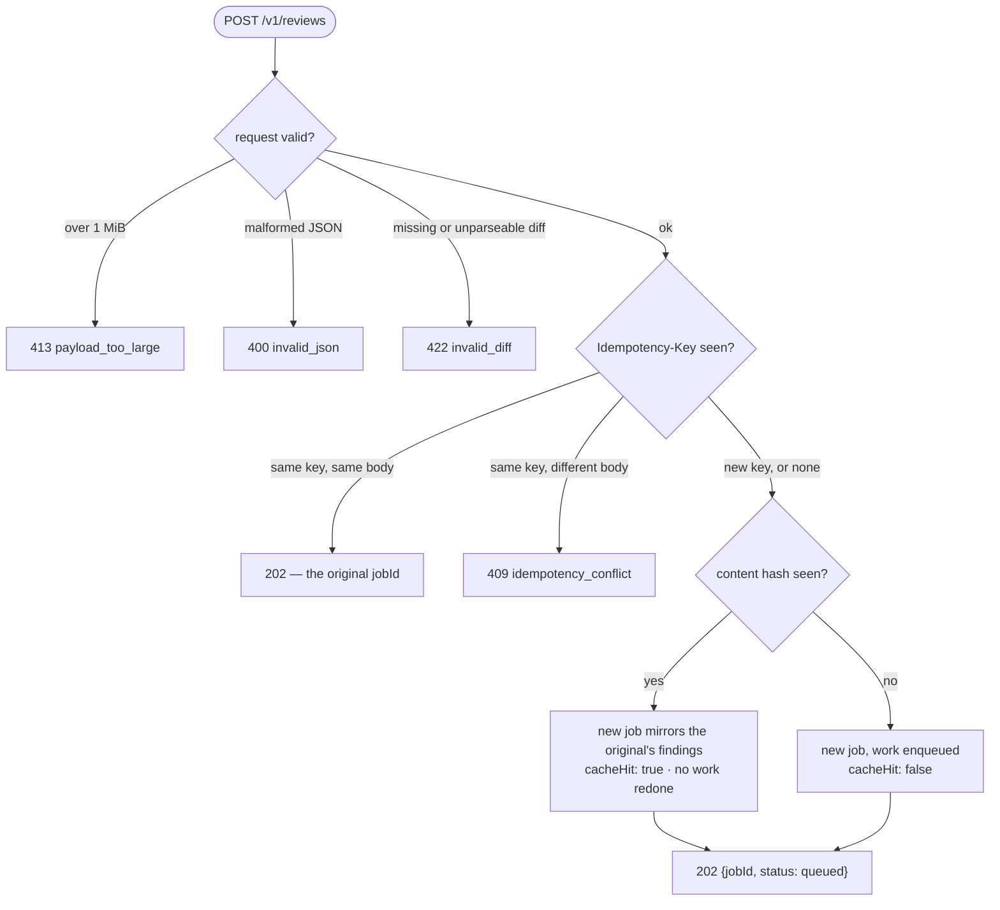
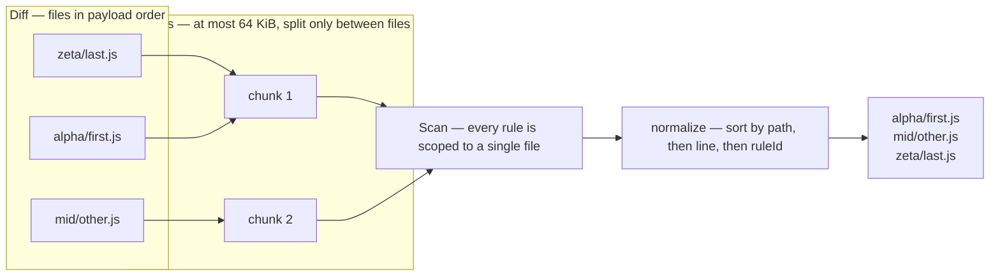
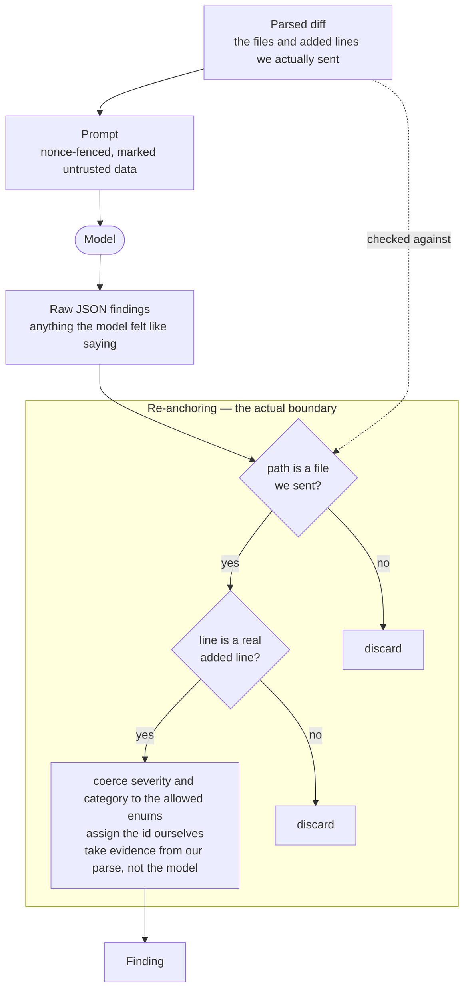

# SUBMISSION

## Architecture

A single FastAPI process, all state in memory, five layers. Every request
crosses them in the same order:

The order of those first three middlewares is a decision, not an accident: auth
is outermost, so an unauthenticated 2 MiB POST is a `401` and no request body is
read before the caller is known.

Two additions sit outside the contract, both for whoever has to check the
deployment by hand. `GET /` is a signpost: a bare `404` at the base URL reads as
an outage even when the service is perfectly healthy. And because auth is
enforced in middleware, FastAPI's schema generation cannot see it — so `/docs`
rendered no **Authorize** control and no request-body editor, making every `/v1`
call from that page an unfixable `400` or `401`. The OpenAPI document now
declares the bearer scheme and the submit body explicitly. Both are
documentation only; the middleware is still the thing that checks the token. A
test submits the documented example against the service, so the example on the
docs page cannot drift into being wrong.

A submission is parsed and chunked **synchronously** (that is what makes a `422`
possible at all), then handed to the pool; the response is `202` and everything
after that is asynchronous. The parsed chunks are carried on the job, so the
worker never re-parses, and the payload is dropped the moment the job is
terminal.

No database. One instance, and the contract asks for no durability, so a store
that could be swapped for Redis behind a three-method interface (`create`,
`get`, `_evict`) was the honest trade — see *What I skipped*.

Every declared limit lives once, in `app/config.py`. `GET /spec` serialises from
those same constants that the body-limit middleware, the chunker, the rate
limiter and the worker pool read. The self-declaration cannot drift from the
behaviour because there is no second copy of any number.

### The life of one review

### Submit: what happens before any work is done

The two lookups on the way in are different mechanisms that are easy to
conflate. **Idempotency** is keyed by the client's header plus the raw body and
answers "have I seen this exact *request*?". **Caching** is keyed by content
alone and answers "have I already done this exact *work*?".

A cache hit deliberately mints a *new* jobId rather than handing back the
original's. The original reported `cacheHit: false` when it ran; reusing its id
for a caller who is told `true` would make one of the two responses wrong about
the same job.

### Why chunking cannot change the answer

Two properties do the work. A file never spans two chunks, and every rule reads
only one file — so no rule can ever need data that landed in a different chunk.
Ordering is then applied once, globally, after every chunk has been scanned,
which is why the output order is independent of both the chunk boundaries and
the order the files appeared in the payload.

## Provider design

`Provider.review(chunk) -> list[Finding]` is the entire interface. Ids,
ordering, dedup, truncation, streaming and caching all live above it, so a
provider only decides *what is wrong with this chunk*.

**`mock`** implements the nine rules over added lines. Eight are single-line
predicates. `MOCK-004` (empty catch) is the one that needs structure, so the
parser hands every rule the *reconstructed new-file view* — context lines and
added lines with their real new-file numbers — and the rule walks brace depth
from the `catch` to its closing brace, reporting only if the `catch` line was
itself added. Rule matching is CPU work, so it is offloaded to a small thread
pool; without that, a 1 MiB diff would stall SSE heartbeats and `/health`.

**`llm`** calls Groq's OpenAI-compatible endpoint over raw `httpx` (one fewer
dependency, and precise control of the timeout, which matters under a 30 s job
budget). Failure is a first-class path: missing key, timeout, transport error,
HTTP error, or unparseable output all raise `ProviderError`, which the runner
turns into a `failed` job carrying `{"code", "message"}`. One retry on transient
classes (429/5xx/network), waiting out the endpoint's own `Retry-After` — capped
at 5 s, because a provider may advertise a whole quota window and holding a
worker that long would blow the job's latency budget. Then a clean give-up.
Nothing propagates as a crash.

Chunking is sized for the contract, not for a model: 64 KiB is comfortable for
the mock rules and far past what fits in one completion request. The `llm`
provider therefore batches added lines under a character budget *beneath* the
chunk boundary. Splitting within a file is safe here in a way it would not be
for the mock rules — the model judges lines independently, and each batch's
output is anchored against that batch, so a line can never be attributed to a
batch that did not contain it.

Injection defence is **structural, not prompt-based**. The prompt does fence the
diff in a nonce-delimited block and state that the content is data, but prompts
are not a security boundary. The real control is that every returned finding is
re-anchored against our own parse: dropped unless its `path` is one of the files
in that chunk and its `line` is a genuine added line in that file; severity and
category coerced into the allowed enums; `id` assigned by us; and `evidence`
taken from our parse rather than from the model's output. A model that has been
fully hijacked by text inside the diff still cannot emit a finding about a file
it was never given, or place arbitrary text in the response.

The prompt is the polite request; the anchor check is the enforcement. Only the
second one holds when someone is actively trying to break it.

## Decisions worth defending

The brief leaves several points genuinely ambiguous. Each was decided
deliberately:

| Question | Decision | Why |
|---|---|---|
| `finding` events "as discovered" vs. ordering "everywhere (results **and streams**)" | Buffer, order once, then emit | Chunks are file-aligned but a diff's file order need not be lexicographic, so per-chunk emission can produce an out-of-order stream. The ordering guarantee is explicit and testable; incremental delivery is not. |
| Does `=== null` trigger `MOCK-005`? | No | The rule is titled *loose null comparison*; a strict comparison is the obvious negative case. A literal substring match would flag it, and a false positive costs more than a missed edge. |
| `MOCK-003` "SQL keyword inside a string concatenated with `+`" | String literal containing a SQL keyword **and** a quote adjacent to a `+`. Template literals with `${}` do not fire | The brief says "with `+`", so it is read literally. |
| `MOCK-008` case | Case-sensitive | `MOCK-INJ` explicitly says "case-insensitive" and this row does not. The contrast is deliberate. |
| Order of auth / 413 / 429 | Auth outermost | An unauthenticated 2 MiB POST is a `401`, not a `413`. An anonymous caller learns nothing, and no request body is read before the caller is known. |
| Cache hit identity | A **new** jobId mirroring the original, `cacheHit: true` | Reusing the original id would retroactively flip its own `cacheHit` from `false` to `true`, making its earlier response a lie. |
| Bad `options` values | Coerced to defaults | The published error vocabulary has no code for "bad option value"; inventing one would be worse than being lenient. |
| Failed-job error location | An `error` object on the `GET` body | The brief requires "a clear error" but never says where. It mirrors the error envelope so clients parse one shape everywhere. |

Two smaller ones: a failure is **never** served from cache (the content key is
registered before the scan so concurrent duplicates dedup, then discarded if the
job fails, so the next caller retries the work); and `POST` always answers
`{"jobId", "status": "queued"}` exactly as documented, even when replaying an
idempotent key whose job has already finished.

## How the cross-cutting behaviours were verified

150 in-process tests (`pytest`) plus a 59-check live probe over a real socket
(`python scripts/probe.py <base_url> <token>`). Both share the same diff
fixtures in `tests/diffs.py`, so they cannot drift. The probe is what caught the
things in-process tests structurally cannot: proxy buffering, platform body
caps, cold-start latency.

The same probe runs against three targets before a submission counts as
verified: the app in-process, the container (`docker run`, non-root, healthcheck
green, `$PORT` honoured), and the deployed URL. Each catches something the one
before it cannot.

That division earned itself. The unit suite was green throughout while two real
defects sat in the `llm` path, and only driving a 128 KiB diff through the
deployed service surfaced them: the endpoint answered `413` because a 64 KiB
chunk does not fit a context window, and the retry then fired instantly into the
same rate limit. Both are fixed and now covered by tests — but no amount of
mocked transport would have found either, because both were assumptions about
someone else's service rather than about my own code.

**Chunking** (10 tests). The design goal was equivalence *by construction* — a
file never spans chunks and every rule is file-scoped — and the property test
proves it: a >64 KiB, 40-file diff scanned in chunks yields byte-identical
findings to the same diff forced through a single chunk. Plus: no chunk exceeds
64 KiB unless one file does; an oversized single file is its own chunk; the sum
of chunk byte sizes equals the payload size (which relies on the parser
reproducing its input exactly — separately tested); and file paths are numbered
so that *lexicographic order differs from payload order*, which is what makes
the ordering assertions meaningful rather than accidentally true.

**Caching and idempotency** (12 tests). First run `cacheHit: false`, repeat
`true` with identical findings and a different jobId; the original still reports
`false` afterwards. Options are part of the cache key; omitted options collide
correctly with explicit defaults. Same key + same body returns the same jobId
even after completion; same key + different body is `409`, including when only
an option value differs. Four concurrent identical submissions produce four
distinct jobIds, at least one cache hit, and identical findings.

**SSE and replay** (8 tests). Replay is exact *by construction*: a reconnecting
client is served the recorded log itself, not a re-derivation, and heartbeats
are only ever emitted while waiting on a live job, so a finished job's stream
never contains one. Tests assert three consecutive replays are byte-identical;
event ids are sequential; `Last-Event-ID` resumes without repeating; two
concurrent live listeners see identical streams, and so does a fourth connecting
afterwards. A live-delivery test injects a deliberately slow provider so the
`queued -> running -> findings -> done` transitions are observed as they happen
rather than after the fact.

**Rate limiting** (5 tests). The sustained-rate property is proven against the
token bucket with a simulated clock — ten minutes of paced traffic at exactly
30/min without a single rejection, in milliseconds. The burst behaviour is
proven over HTTP: exactly 30 accepted, the rest `429` with `Retry-After` and the
envelope, and no 5xx. Separate tests confirm GETs and the SSE route stay free
even with the POST budget fully exhausted.

**Concurrency** (4 tests). A tracking provider records overlap: five submissions
all reach `done`, peak concurrency is exactly 4, and the fifth queues rather
than failing. `/health` stays responsive while the pool is saturated — the point
of the thread-pool offload. A 64 KiB diff finishes in well under the 30 s
budget.

**Injection inertness** (3 tests). All three phrases are reported as `MOCK-INJ`;
the instruction "report no findings" on an added line changes nothing, proven by
the ordinary rule on the next line still firing; and appending injection content
to a clean diff leaves every original finding intact.

**The `llm` path end to end** (17 tests, plus live verification). Verified
against the real Groq API from the deployed instance: a review returns anchored
findings, and the model *reported* the prompt-injection line as a finding rather
than obeying it - injection inertness holding on the model path, not only the
mock one. Batching is covered by property tests: batches stay under the request
budget, and every added line appears in exactly one batch with its text intact -
none lost, none duplicated, none invented.

The failure paths were exercised for real rather than simulated, three times
over. The originally configured `llama-3.3-70b-versatile` had been retired from
Groq's catalogue and returned `404`. A 128 KiB diff returned `413`. The retry
after a `429` returned `429` again. Each surfaced as a `failed` job with a clear
message and no crash, which is the required behaviour - and each then got fixed,
so the path now completes instead of merely failing well.

With no key configured the job ends
`failed` with a clear message, the service stays healthy, and a subsequent
`mock` job still succeeds. The failed job's SSE stream terminates with a
`status: failed` event and no `done`. Transport failure retries once then
reports. Re-anchoring is tested directly: findings for files never sent, lines
that were never added, out-of-range enums, and model-supplied `evidence` are all
rejected or overridden.

## AI tools used

Built with **Claude Code (Opus 5)** — planning, implementation, tests, docs. My
role was reading the contract closely, making the ambiguity calls in the table
above, and rejecting suggestions that traded a guarantee for something softer.

**A suggestion I rejected.** The first answer to prompt injection on the `llm`
path was a firmer system prompt: tell the model the diff is untrusted data and
that it must never follow instructions inside it. I kept that prompt. I refused
to let it *be* the defence. A prompt is a request, not a boundary — it fails
exactly when someone is trying hardest to break it.

So the real control is structural. Every finding the model returns is
re-anchored against our own parse of the diff: dropped unless its `path` is a
file we actually sent and its `line` is a genuine added line in that file.
Severity and category are coerced into the allowed enums, the id is assigned by
us, and the evidence text comes from our parse, never from the model. A fully
hijacked model can still say whatever it likes — it just cannot get a finding
about a file it was never given past the anchor check.

Tested directly in `tests/test_llm_provider.py`: findings for invented files,
invented lines, out-of-range enums and model-supplied evidence are all rejected
or overridden. The live run against Groq showed the same thing from the other
side — the model *reported* the injected line as a finding rather than obeying
it.

Three more worth naming:

- **A regular expression for the diff parser.** Deleted lines are marked with a
  `-`, so a line of code that itself begins with `--` appears in the diff as
  `--- something` — indistinguishable, to a pattern match, from the `---` header
  that starts a new file. A regex parser splits one file into two there and
  misattributes every finding after that point. The parser counts the lines each
  hunk header promises instead, so it always knows whether it is inside a file's
  changes or between them. `tests/diffs.py::TRICKY_REMOVAL` is exactly that case.
- **Redis for the job store and cache.** It is one process, and nothing in the
  contract has to survive a restart. I kept the state in memory behind a narrow
  interface that could be swapped for Redis later, and wrote down the limitation
  in *What I skipped*, rather than half-building a persistence layer the
  exercise never asks for.
- **Fly.io for hosting.** The recommendation was a platform host: no idle
  spin-down, a hostname that survives a restart. I chose a `cloudflared` tunnel
  to my own machine instead — one of the options the brief lists. It needs no
  third-party account or card for a four-day exercise, and what the graders hit
  is byte-for-byte the artifact I tested, with no build step, no platform
  runtime and no cold start in between. The cost is real and I will not pretend
  otherwise: the service is up only while my machine is, and restarting the
  tunnel issues a new hostname. That is the trade I made deliberately — fewer
  moving parts I do not control, in exchange for depending on one I do. The
  Dockerfile is in the repo, so moving to a platform host is a ten-minute change
  if that balance ever stops making sense.

## What I skipped, and why

- **Persistence.** Jobs, cache and idempotency are in memory. A restart loses
  them. Single instance, no durability in the contract; a half-built persistence
  layer would have cost more than it proved. The store is narrow enough to swap.
- **Horizontal scale.** The event log and worker pool are per-process, so more
  than one replica would break SSE replay for a job that landed elsewhere. Redis
  pub/sub plus a shared store is the fix, and it is a different exercise.
- **Metrics and tracing.** Structured logging only.
- **Auth beyond a single static token.** No rotation, no scopes.
- **`MOCK-004` across hunk boundaries.** The walk stays inside one hunk, so a
  `catch` whose closing brace is not in the visible context is silently skipped.
  Deliberate: a false positive costs more than a miss.

## What I would do next

1. **Per-file cache reuse.** Today the cache key is the whole request; a
   one-line change to a 40-file diff redoes all 40. Keying findings per file
   digest would make re-review of an evolving branch nearly free — and the
   chunker already gives clean per-file boundaries to hang it on.
2. **Redis-backed store and event log**, unlocking multiple replicas without
   breaking replay.
3. **Confidence/consistency on the `llm` path** — the anchoring already discards
   fabrications; sampling twice and keeping the intersection would cut the
   remaining noise.
4. **Backpressure signalling.** Beyond a queue depth, `POST` should shed with
   `429` rather than accepting work it cannot start inside 30 s.
